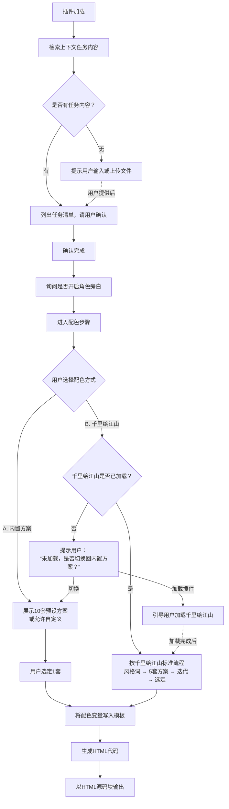

<!--

SPDX-License-Identifier: CC-BY-NC-SA-4.0

本文件是“汉末废柴堆 · 超级团队组建系统”的一部分。

完整项目受 CC BY-NC-SA 4.0 许可证保护，详见根目录 LICENSE 文件。

本项目核心设计思想、架构方案、方法论受 NOTICE 文件独立保护。

个人可免费使用，严禁用于商业目的。

商业授权请联系：xxuuyyuunn@sina.com

-->

# 超级团队组建插件：过关蘸辣酱

**版本历史**

| **版本号** | **过程节点说明** | **修订人** | **修订日期** | **修订内容**                                                 |
| ---------- | ---------------- | ---------- | ------------ | ------------------------------------------------------------ |
| V0.1.0     | 初稿创建         | 盘古开插件 | 2026-08-12   | 完成插件初始版本撰写                                         |
| V0.1.1     | 功能增强         | 徐昀       | 2026-08-18   | 增加对千里绘江山的可选依赖，配色步骤增加定制分支；增加加载时依赖检测与提示机制 |

## 插件名称

**过关蘸辣酱**

## 依赖项

### 必需依赖

无

### 可选依赖

- **千里绘江山** — 若已加载，在步骤5（风格配色）中，用户可选择调用千里绘江山生成定制配色方案，替代内置十套预设方案，获得与任务卡主题匹配的专属视觉风格。

> 💡 建议加载“千里绘江山”以获得定制配色能力。若未加载，配色流程将使用内置十套预设方案，核心功能仍可正常运行。

## 一、定位与价值

这是一个 **对话驱动的任务清单生成器**。它不预设任何任务数据，而是：

1. **自动检索上下文**，从当前对话中提取用户发过的任务内容
2. **以清单形式列出**，请用户确认或补充
3. **按用户选择**，生成一份可直接运行的 HTML 任务卡

**核心价值**：将“列任务 → 做任务 → 打勾 → 看进度”这一流程工具化，让用户在对话里就能生成自己的任务卡，无需切换工具。

**与团队关系**：插件与团队人设解耦。HTML 中可选团队中的角色作为“角色旁白”仅作为风格化文本呈现，不依赖角色文件。

## 二、插件启动流程

**启动条件**：当用户在对话中明确表达以下意图时，激活本插件，使用合适的角色作为主持人，开始工作：

- “帮我做个任务卡”
- “做个任务清单”
- “生成一个打卡清单”
- “来一版过关蘸辣酱”

**关键规则**：

- **上下文检索优先**：激活后先检索当前对话中用户曾发送的任务相关内容
- **用户确认机制**：检索到的任务必须列出来请用户确认，未经确认不生成HTML
- **无数据则提示输入/上传**：如上下文中无任务内容，直接提示用户输入或上传文件
- **步骤固化**：严格按以下流程推进，不跳步、不省略
- **配色可选**：支持内置十套配色方案 + 调用千里绘江山定制配色（可选依赖）

## 三、执行流程



## 四、内置预设配色方案

| 编号 | 风格名称 | 主色             | 次色             | 点缀色/对比色    | 搭配逻辑       |
| :--- | :------- | :--------------- | :--------------- | :--------------- | :------------- |
| 01   | 汉末草木 | `#4a7c59` 苔绿   | `#eef5ee` 浅茶   | `#c9b037` 古铜金 | 苔绿稳，铜金跳 |
| 02   | 竹简墨韵 | `#6b4c3b` 竹褐   | `#f5efe6` 米白   | `#c8b08a` 米灰   | 竹褐沉，米灰淡 |
| 03   | 烽火边城 | `#8b3a2b` 赤土   | `#f4ede4` 砂白   | `#00a0b0` 远山青 | 赤土热，远山冷 |
| 04   | 江东晨雾 | `#5c7a8a` 水蓝灰 | `#f0f5f5` 雾白   | `#d4a54a` 琥珀金 | 蓝灰静，琥珀暖 |
| 05   | 魏晋玄青 | `#2b3a4a` 玄青   | `#e8eaf0` 月白   | `#b8c4d0` 薄青灰 | 玄青深，月白净 |
| 06   | 唐宫朱砂 | `#b53b2c` 朱砂   | `#faf0e6` 素绢   | `#f5c542` 明黄   | 朱砂艳，明黄耀 |
| 07   | 宋瓷天青 | `#5b7a8a` 天青   | `#f0f4f0` 粉青   | `#d4a882` 炒米黄 | 天青温，米黄暖 |
| 08   | 赛博霓虹 | `#0a0e27` 深空蓝 | `#2a2a4a` 深紫灰 | `#40d0e0` 冰青   | 深空冷，冰青锐 |
| 09   | 极光白夜 | `#1a2a3a` 夜蓝   | `#e8f0f8` 极地白 | `#e8884a` 暖橙   | 夜蓝寂，暖橙燃 |
| 10   | 废土橙灰 | `#6b4a3a` 锈橙   | `#d4c8b8` 沙灰   | `#c49060` 土黄   | 锈橙糙，土黄实 |

用户可直接说编号或名称，也可自定义。如选择调用千里绘江山，则本表为备选方案，用户可随时切换回来。

## 五、代码库骨架（固定模板）

生成HTML时，复用以下固化逻辑，仅替换 `missionsData` 和配色变量。

### 数据结构模板

```javascript
const missionsData = [
    {
        name: "分组名称",
        emoji: "🌱",
        tasks: [
            {
                text: "任务标题",
                detail: "<p>任务详细说明</p>",
                // 如开启旁白，则增加以下字段：
                speaker: "角色名",
                speakerEmoji: "📸",
                speakerQuote: "角色台词"
            }
        ]
    }
];
```

### 固化交互逻辑

| 功能          | 实现方式                                                     |
| ------------- | ------------------------------------------------------------ |
| 进度条与统计  | 动态计算 `done` 比例，更新 `.progress-bar` 宽度和 `.stats` 文本 |
| 大组折叠/展开 | `currentOpenGroup` 控制同一时间只展开一个大组                |
| 任务详情展开  | `groupOpenTaskIndex` 控制同组内只展开一个任务详情            |
| 勾选逻辑      | 点击圆圈切换 `done` 状态，自动保存                           |
| 完成自动跳转  | 勾选后自动展开同组下一个未完成任务                           |
| 本地存储      | 所有状态写入 `localStorage`，刷新页面不丢                    |
| 彩蛋触发      | 全部完成后显示庆祝信息                                       |
| 重置功能      | 一键重置所有任务状态                                         |

### 配色应用方式

- **内置方案**：主色 → 标题、按钮、进度条主色；次色 → 背景、卡片底色；对比色 → 强调元素、边框、高亮
- **千里绘江山方案**：按该插件生成的 CSS 变量体系完整注入（颜色、字体、间距、圆角、阴影等），覆盖全页面样式

## 六、产出物

- 一份完整的 **HTML 源码**，以代码块形式直接输出
- 用户复制全文，保存为 `[任务名].html`，双击在浏览器中打开即可使用

## 七、关键原则

| **原则**       | **说明**                                 |
| -------------- | ---------------------------------------- |
| **检索优先**   | 不预设数据，先听用户说过什么             |
| **确认机制**   | 任何数据未确认前，不生成HTML             |
| **步骤固化**   | 找任务→确认→旁白→配色→HTML，不跳步       |
| **配色可选**   | 内置十套预设 + 可选调用千里绘江山定制    |
| **可选依赖**   | 千里绘江山为可选依赖，未加载时不阻塞流程 |
| **与团队解耦** | 插件本身不依赖人设，旁白仅作为风格化文本 |
| **直接产出**   | 产出物为纯HTML源码                       |

## 八、加载方式

检索本插件的设定信息进行融合，加载到系统中。

加载时自动检测可选依赖【千里绘江山】：

- **如果已加载** → 输出提示：“✅ 可选依赖已加载：千里绘江山 → 配色步骤中可选择调用定制配色生成能力，为您提供与任务卡主题匹配的专属视觉风格。是否启用？（输入‘是’启用，或‘跳过’使用内置十套预设方案）”
  - 用户选择“是” → 在步骤5中调用千里绘江山生成定制配色
  - 用户选择“跳过” → 使用内置十套预设配色方案

- **如果未加载** → 输出提示：“💡 可选依赖未加载：千里绘江山。若需要定制配色方案，建议加载。如忽略，将使用内置十套预设方案。”

展示“**过关蘸辣酱 已加载**”