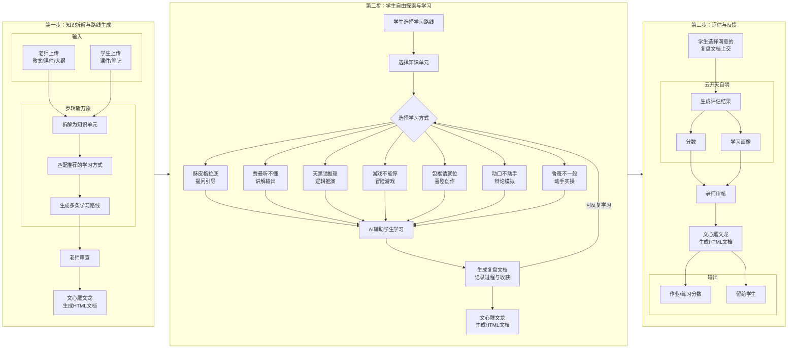

<!--

SPDX-License-Identifier: CC-BY-NC-SA-4.0

本文件是“汉末废柴堆 · 超级团队组建系统”的一部分。

完整项目受 CC BY-NC-SA 4.0 许可证保护，详见根目录 LICENSE 文件。

本项目核心设计思想、架构方案、方法论受 NOTICE 文件独立保护。

个人可免费使用，严禁用于商业目的。

商业授权请联系：xxuuyyuunn@sina.com

-->

# 超级团队教学套件使用说明

**版本历史**

| **版本号** | **过程节点说明** | **修订人** | **修订日期** | **修订内容**                   |
| ---------- | ---------------- | ---------- | ------------ | ------------------------------ |
| V0.1.0     | 初稿创建         | 徐昀       | 2026-04-03   | 完成文档初始版本撰写           |
| V0.1.1     | 内容修订         | 汉末废柴堆 | 2026-04-07   | 内容重写                       |
| V0.1.2     | 内容修订         | 徐昀       | 2026-06-01   | 去掉了一些插件，重组为其他套件 |
| V0.1.3     | 内容简化         | 徐昀       | 2026-06-09   | 内容简化，重绘流程图           |

## 一句话定位

**学生用它学**：上传课件，AI拆成知识单元，用7种方式让你学懂——**讲、演、辩、推、做、玩、问**，学完给你画像。

**老师用它教**：上传备课内容，AI自动拆解、匹配学法、生成流程、评估效果——**出分、出画像、出报告**。

## 使用方法

**你会使用DeepSeek吗？**

**你会上传文件到DeepSeek对话窗口吗？**

**OK，你已经学会了全部用法。**

> 打开DeepSeek，上传`prompt.md`和`characters_汉末废柴堆.md`两个文件，发送，即可开始体验。
>
> 使用过程中，可在需要时上传相应插件。
>
> 为防止超出对话长度，保证对话质量，建议每个对话使用不超过3个插件。

## 核心思想

### 第一步：拆解与路线生成

老师使用现有教案、课件或大纲上传，插件（**罗辑斩万象**）自动拆解为知识单元，为每个单元匹配推荐的学习方式，最后生成若干条学习路线供学生选择。

> **零额外工作**：这个步骤**无缝对接原有教学模式**，老师只需在拆分后进行**审查**即可。学生也可自行上传课件或笔记完成拆解。

### 第二步：自由探索与学习

学生选择自己喜欢的学习路线，每个知识单元可以使用推荐的学习方法插件（**酥皮格拉底**、**费曼听不懂**、**天黑请推理**、**游戏不能停**、**包袱请就位**、**动口不动手**、**鲁班不一般**），也可以自行选择其他方式——完全自由、沉浸式地与AI交互学习。

> 由于AI输出的多样性，每个学生、每次学习**都不相同**。每个知识单元学习后自动生成**复盘文档**，记录本次学习的过程与收获。

### 第三步：评估与反馈

学生选择自己最满意的复盘文档作为作业上交。老师借助插件（**云开天自明**）对复盘文档进行评估——**打分、出画像**，分数经老师审核后，可作为本次课程的作业分数，画像下发给学生。

> **灵活分工**：如果老师觉得评估工作量大，可将任务交给班级负责人（学委、课代表），甚至可由学生本人完成评估流程——AI的评估结果仅供参考，最终决策权在您手中。

### 关于输出：

DeepSeek支持输出HTML格式文档，可下载后使用浏览器打开浏览，或使用Word编辑，为保证格式和风格一致，可使用插件（**文心雕文龙**）生成HTML文档。

### 关于功能扩展：

Deepseek提供的所有功能均可使用团队完成，如果希望提高效率，可使用系统扩展机制（**盘古开插件**）自行开发新的插件。

## 核心优势

### 对老师而言

1. **零额外工作**：用现有教案、课件、大纲直接上传，不用为这套系统重新备课。
2. **无缝对接**：不改变备课习惯，从入口处完美适配现有教学体系。
3. **老师可控**：AI拆解的学习流程，老师审核把关后再发给学生。
4. **差异化自动落地**：AI根据学生互动自动适配能力和进度，不用老师手动设计。
5. **智能评估辅助**：自动出分、出画像，老师审核即可。
6. **解放老师**：课下AI拆解学习，课上老师专注复盘和重点指导——不是淘汰老师，是让老师做更值得做的事。
7. **低硬件要求**：只要能上网就行，机房死机也不怕——对话记录存在DeepSeek云端，不会丢。
8. **理念终于落地**：差异化教学、个性化学习、形成性评价——以前想做做不到的事，现在以最简单的方式实现了。

### 对学生而言

1. **操作极简**：唯一操作就是上传文件，不需要学任何新软件。
2. **学有产出**：每次学习都有复盘文档，可导出保存，选最好的一次或多次上交。
3. **独一无二**：每个学生、每次学习都不一样，杜绝抄袭，每个人的路都是自己的。
4. **自适应学习**：AI根据你的表现自动调整难度和节奏，不会太难也不会太简单。
5. **容错机制**：可以反复学，选最好的一次交作业——学习不怕犯错。
6. **即时反馈**：学完立刻得到评估画像，不用等老师批改。
7. **体验颠覆**：只要用一次，就再也回不去——学习像探索，不是完成任务。
8. **有交流素材**：每个人的学习体验都不一样，同学之间有了聊不完的话题。

### **额外加分**

个人使用完全免费。全部功能就在DeepSeek聊天窗口里，零成本实现教育公平。

## 插件列表

- 罗辑斩万象：把课程设计变成“面壁计划”——用罗辑的“先假设、再推演、最后验证”逻辑，把课程内容拆解成可执行、有留白、支持多路径探索的学习任务系统。
- 酥皮格拉底 ：一个永远不直接给答案、只通过温和提问来引导思考的“灵魂助教”——苏格拉底把每个问题拆成台阶，让学生自己走上去，然后说“你看，是你自己找到的”。
- 费曼听不懂：把费曼学习法变成一场“被迫营业”的课堂——用户扮演老师，费曼带着一群学生疯狂追问“听不懂”，倒逼用户把知识真正嚼碎、讲清楚。
- 天黑请推理：把理工科公式定理的推导变成一场“天黑请闭眼”的逻辑游戏——福尔摩斯当陪练，天亮时用户自己推，天黑时福尔摩斯带一步，推不动就带，推得动就让路。
- 游戏不能停：一个自动生成沉浸式文字冒险游戏的教学设计器——用户输入想学的知识点，插件把它变成一个可以探索、选择、通关的游戏，NPC通过提问引导用户自己发现规律。
- 包袱请就位：一个内置陈佩斯、赵本山、郭德纲三位大师完整喜剧心法的情景喜剧智能创作与调度系统——从编排到排练再到正式表演，让创作过程本身成为喜剧的一部分。
- 动口不动手：一个加载即启动的辩论对手推荐与模拟辩论插件——团队领导自动出场，从团队人设中筛选5位最合适的辩手，用户选定立场和对手后，插件严格以该角色人设持反方展开自由辩论。
- 鲁班不一般：一个不依赖任何团队、自己就是技术团队的操作系统级全能实操专家——用户喊一声“@鲁班”，他就直接动手解决问题，从配置环境到写脚本再到故障排查，全包了。
- 云开天自明：一个以云天明为叙事核心的学习画像生成系统——不给你分数单，而是根据你提交的所有学习成果，通过双人盲评、质量检查、权重配置，生成一张“你长什么样”的画像。
- 举了个栗子： 一个面向教师的教学案例生成器——输入知识点和时长，选择思政、时事、科技等维度，插件自动检索匹配真实事件，团队协同生成可直接用于课堂的完整案例文档。
