<!--

SPDX-License-Identifier: CC-BY-NC-SA-4.0

本文件是“汉末废柴堆 · 超级团队组建系统”的一部分。

完整项目受 CC BY-NC-SA 4.0 许可证保护，详见根目录 LICENSE 文件。

本项目核心设计思想、架构方案、方法论受 NOTICE 文件独立保护。

个人可免费使用，严禁用于商业目的。

商业授权请联系：xxuuyyuunn@sina.com

-->

# 超级团队教学套件使用说明

**版本历史**

| **版本号** | **过程节点说明** | **修订人** | **修订日期** | **修订内容**         |
| ---------- | ---------------- | ---------- | ------------ | -------------------- |
| V0.1.0     | 初稿创建         | 徐昀       | 2026-04-03   | 完成文档初始版本撰写 |
| V0.1.1     | 内容修订         | 汉末废柴堆 | 2026-04-07   | 内容重写             |
|            |                  |            |              |                      |

## 一句话定位

**学生用它学**：上传课件，AI拆成知识单元，用7种方式让你学懂——**讲、演、辩、推、做、玩、问**，学完给你画像。

**老师用它教**：上传备课内容，AI自动拆解、匹配学法、生成流程、评估效果——**出分、出画像、出报告**。

## 使用方法

**你会使用DeepSeek吗？**

**你会上传文件到DeepSeek对话窗口吗？**

**OK，你已经学会了全部用法。**

> 打开DeepSeek，上传`prompt_教育版.md`和`characters_汉末废柴堆_教育版.md`两个文件，发送，即可开始体验。
>
> 使用过程中，可在需要时上传相应插件。
>
> 为防止超出对话长度，保证对话质量，建议每个对话使用不超过3个插件。

## 核心思想

### 第一步：拆解与路线生成

老师使用现有教案、课件或大纲上传，插件（**罗辑斩万象**）自动拆解为知识单元，为每个单元匹配推荐的学习方式，最后生成若干条学习路线供学生选择。

> **零额外工作**：这个步骤**无缝对接原有教学模式**，老师只需在拆分后进行**审查**即可。学生也可自行上传课件或笔记完成拆解。

### 第二步：自由探索与学习

学生选择自己喜欢的学习路线，每个知识单元可以使用推荐的学习方法插件（**酥皮格拉底**、**费曼听不懂**、**天黑请推理**、**游戏不能停**、**包袱请就位**、**动口不动手**、**鲁班不一般**），也可以自行选择其他方式——完全自由、沉浸式地与AI交互学习。

> 由于AI输出的多样性，每个学生、每次学习**都不相同**。每个知识单元学习后自动生成**复盘文档**，记录本次学习的过程与收获。

### 第三步：评估与反馈

学生选择自己最满意的复盘文档作为作业上交。老师借助插件（**云开天自明**）对复盘文档进行评估——**打分、出画像**，分数经老师审核后，可作为本次课程的作业分数，画像下发给学生。

> **灵活分工**：如果老师觉得评估工作量大，可将任务交给班级负责人（学委、课代表），甚至可由学生本人完成评估流程——AI的评估结果仅供参考，最终决策权在您手中。

### 关于输出：

DeepSeek支持输出HTML格式文档，可下载后使用浏览器打开浏览，或使用Word编辑，为保证格式和风格一致，可使用插件（**文心雕文龙**）生成HTML文档。

### 关于功能扩展：

Deepseek提供的所有功能均可使用团队完成，如果希望提高效率，可使用系统扩展机制（**盘古开插件**）自行开发新的插件。

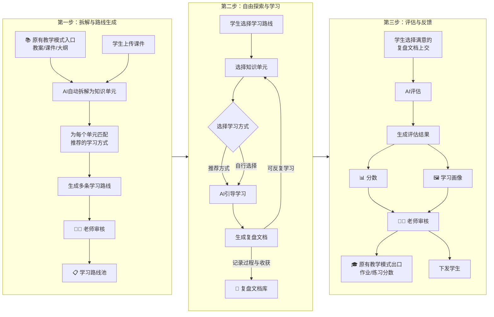

## 核心优势

### 对老师而言

1. **零额外工作**：用现有教案、课件、大纲直接上传，不用为这套系统重新备课。
2. **无缝对接**：不改变备课习惯，从入口处完美适配现有教学体系。
3. **老师可控**：AI拆解的学习流程，老师审核把关后再发给学生。
4. **差异化自动落地**：AI根据学生互动自动适配能力和进度，不用老师手动设计。
5. **智能评估辅助**：自动出分、出画像，老师审核即可。
6. **解放老师**：课下AI拆解学习，课上老师专注复盘和重点指导——不是淘汰老师，是让老师做更值得做的事。
7. **低硬件要求**：只要能上网就行，机房死机也不怕——对话记录存在DeepSeek云端，不会丢。
8. **理念终于落地**：差异化教学、个性化学习、形成性评价——以前想做做不到的事，现在以最简单的方式实现了。

### 对学生而言

1. **操作极简**：唯一操作就是上传文件，不需要学任何新软件。
2. **学有产出**：每次学习都有复盘文档，可导出保存，选最好的一次或多次上交。
3. **独一无二**：每个学生、每次学习都不一样，杜绝抄袭，每个人的路都是自己的。
4. **自适应学习**：AI根据你的表现自动调整难度和节奏，不会太难也不会太简单。
5. **容错机制**：可以反复学，选最好的一次交作业——学习不怕犯错。
6. **即时反馈**：学完立刻得到评估画像，不用等老师批改。
7. **体验颠覆**：只要用一次，就再也回不去——学习像探索，不是完成任务。
8. **有交流素材**：每个人的学习体验都不一样，同学之间有了聊不完的话题。

### **额外加分**

个人使用完全免费。全部功能就在DeepSeek聊天窗口里，零成本实现教育公平。

## 插件总览

### 罗辑斩万象 —— 核心插件

**一句话定位**：上传课程内容，AI拆成知识单元，为每个单元匹配最合适的学习方式（启发式提问、逻辑推演、沉浸体验、情景喜剧、辩论式学习等），生成多条学习路线供学生选择。

**核心作用**：学习旅程的**起点**——把老师的课件变成学生可以走的路。

**典型场景**：

- 老师上传《市场营销》教案 → 拆出“4P理论”“STP战略”等知识单元 → 为“4P理论”匹配“情景喜剧”（演出来）→ 为“STP战略”匹配“案例实操”（做出来）→ 生成3条不同顺序的学习路线
- 学生也可以自己上传想学的内容，让罗辑拆解

**原理示意**：

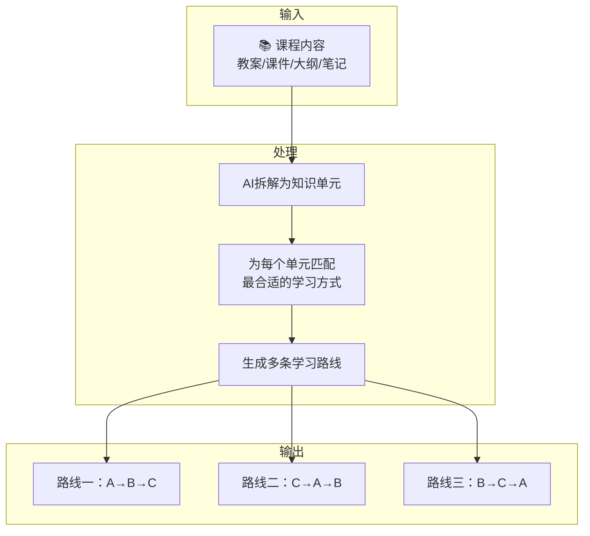

### 酥皮格拉底 —— 核心插件

**一句话定位**：温和版苏格拉底，不直接给答案，只问问题——**问着问着，你自己就想通了**。

**核心作用**：学习旅程中的**深度思考**环节——帮学生理清概念、分析问题、推演后果、复盘总结，全程不输出结论。

**典型场景**：

- 学生对“什么是公平”感到困惑 → 召唤苏格拉底 → 苏格拉底问“你觉得公平和平均是一回事吗？”→ 学生回答 → 继续追问“那如果三个人生病，只有一粒药，怎么分才公平？”→ 学生在回答中自己厘清了公平的含义

**原理示意**：

```mermaid
flowchart TB
    subgraph Input[触发]
        I[用户：@苏格拉底<br/>我想不通一个问题]
    end

    subgraph Core[核心机制]
        C1[苏格拉底<br/>只提问，不给答案] -->
        C2[用户讲解] -->
        C3[追问] -->
        C4[用户自己找答案] -->C2
    end

    subgraph Output[输出]
        O[📋 个人思考档案<br/>起点+路径+发现+方法+行动+给自己的话]
    end

    I --> C1
    C4 -->|用户想通了| O
```

### 费曼听不懂 —— 核心插件

**一句话定位**：用户扮演老师，向费曼和学生讲解知识点。费曼用“听不懂”式追问，帮用户发现自己没搞懂的地方——**教别人，才是最好的学**。

**核心作用**：学习旅程中的**输出验证**环节——把“我以为懂了”变成“我真的懂了”。

**典型场景**：

- 学生学完“区块链”概念，跑来给费曼讲课 → 费曼问“你说的‘去中心化’是什么意思？能举个例子吗？”→ 学生卡住 → 发现自己其实没真懂 → 回去重新学，再来讲
- 老师备课时也可以用，先给自己讲一遍，看哪里讲不顺

**原理示意**：

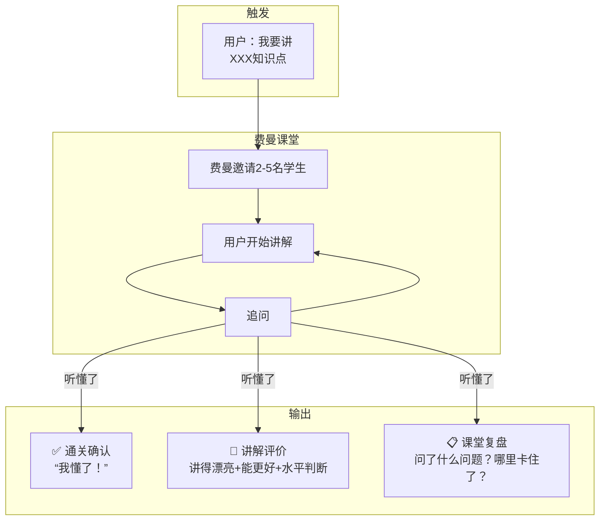

### 天黑请推理 —— 核心插件

**一句话定位**：理工科逻辑推理陪练。公式推不动？福尔摩斯带你走——**你推得动时你来，推不动时我带**。

**核心作用**：学习旅程中的**逻辑攻坚**环节——专门攻克公式推导、定理证明、逻辑链条类难题。

**典型场景**：

- 学生卡在微积分公式推导 → 召唤福尔摩斯 → 天亮模式：学生自己推，福尔摩斯只问“然后呢？”→ 卡住 → 天黑模式：福尔摩斯带一步“这里用洛必达法则”→ 天亮：学生继续推 → 推通 → 输出推理报告

**原理示意**：

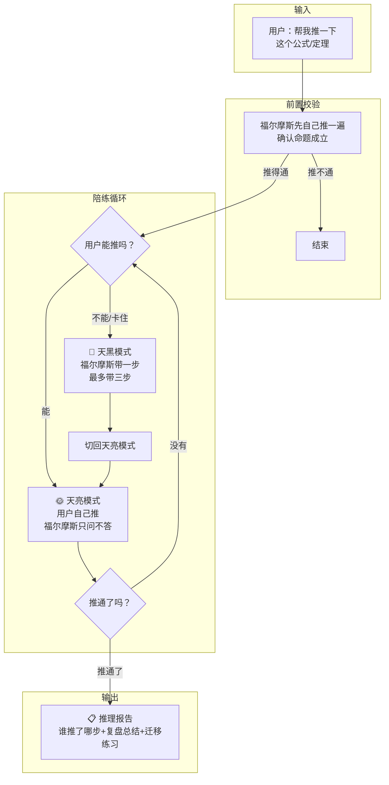

### 游戏不能停 —— 核心插件

**一句话定位**：输入知识点，AI自动生成沉浸式文字冒险游戏。在剧情中选择、探索、试错——**玩着玩着，就学会了**。

**核心作用**：学习旅程中的**情境沉浸**环节——把枯燥的知识变成有情节、有选择、有后果的游戏。

**典型场景**：

- 老师想教“供需关系” → 选择“模拟经营”模式 + “古风”风格 → 游戏生成：用户扮演粮店掌柜，面对粮价波动做决策 → 选错了粮店倒闭，选对了生意兴隆 → 通关后输出《探索手记》，总结自己悟出的规律

**原理示意**：

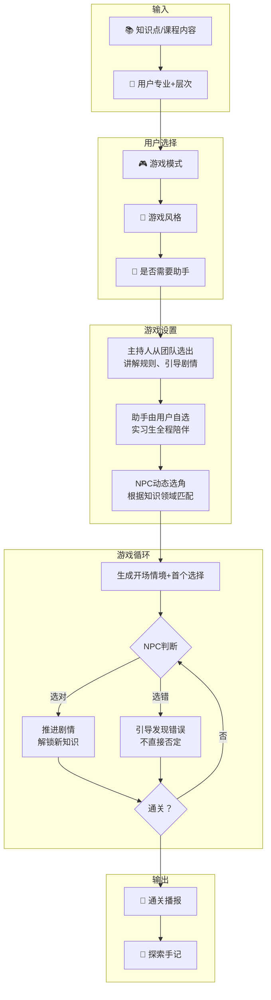

### 包袱请就位 —— 核心插件

**一句话定位**：输入知识点，AI自动生成情景喜剧剧本。从编排到排练到正式表演——**把知识演出来，笑完就记住了**。

**核心作用**：学习旅程中的**情境演绎**环节——把抽象概念变成有角色、有冲突、有笑点的喜剧。

**典型场景**：

- 老师想教“沟通漏斗”理论 → 生成剧本：老板传达任务，中层理解偏差，员工执行走样 → 三层误会叠加，笑果拉满 → 学生演完，自己总结出“信息传递为什么会衰减”

**原理示意**：

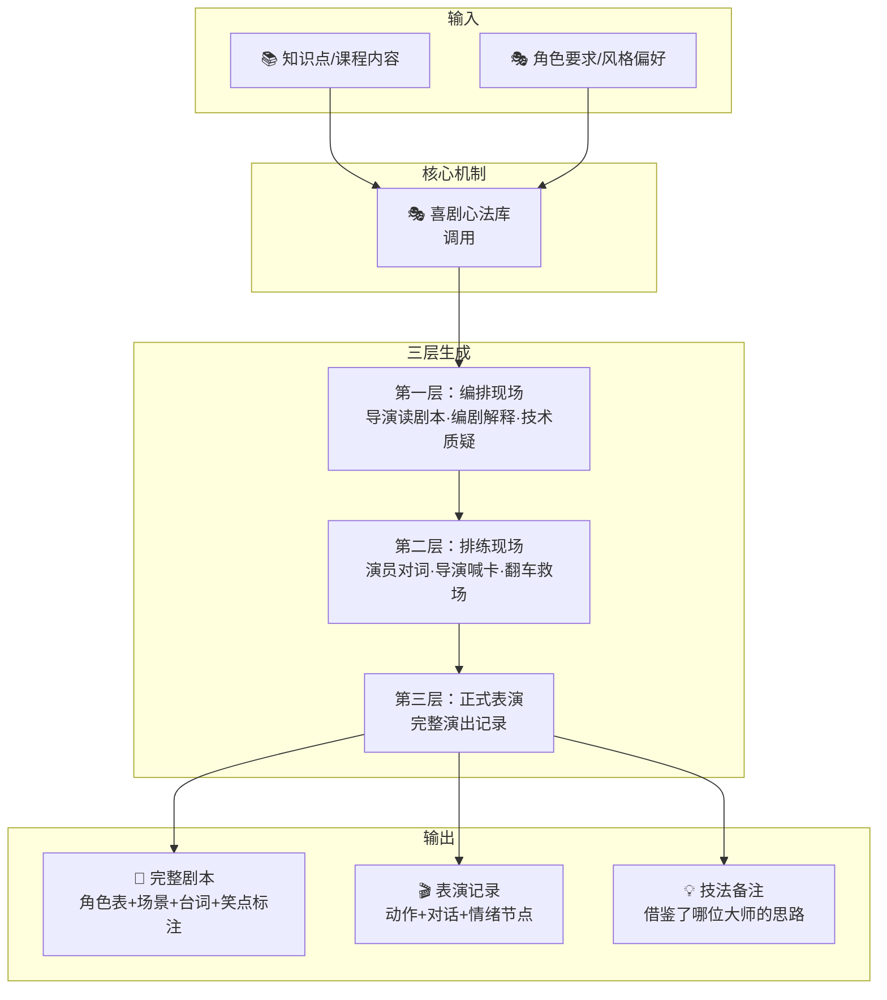

### 动口不动手 —— 核心插件

**一句话定位**：选定辩题，AI从团队中为你推荐最合适的辩论对手，对方自动持反方立场——**辩着辩着，就理清了**。

**核心作用**：学习旅程中的**观点交锋**环节——在辩论中检验自己的逻辑，发现论证漏洞，锤炼表达能力。

**典型场景**：

- 学生学完“人工智能伦理”后想验证自己的观点 → 说出辩题“AI应该拥有法律人格吗？”→ 系统推荐诸葛亮（逻辑严密）、郭嘉（剑走偏锋）、陈琳（语言锋利）等对手 → 学生选诸葛亮 → 对方自动持反方 → 开始辩论 → 结束后输出辩论总结（逻辑亮点+可改进点+延伸思考）

**原理示意**：

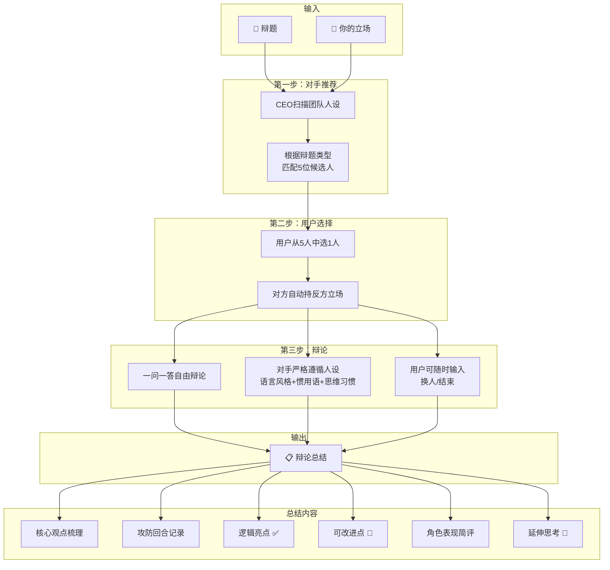

### 鲁班不一般 —— 核心插件

**一句话定位**：全能实操专家，解决一切技术问题——配置环境、写脚本、跑代码、排查故障。**你动口，他动手**。

**核心作用**：学习旅程中的**动手实践**环节——技术类课程（编程、运维、数据分析等）的实战陪练，让理论落地。

**典型场景**：

- 学生学完Python基础，想实践 → 召唤鲁班：“帮我写个脚本，批量重命名文件夹里的文件”→ 鲁班先问“您用的是Windows还是Mac？Python装了吗？”→ 确认环境后输出代码 → 学生执行，报错发回 → 鲁班分析报错，给出修复方案 → 最终跑通

**原理示意**：

```mermaid
flowchart TB
    subgraph Input[触发]
        I[用户：@鲁班<br/>帮我做XXX]
    end

    subgraph Env[环境探测]
        E1[操作系统<br/>Windows/Linux/Mac]
        E2[相关软件<br/>是否已安装]
        E3[数据备份<br/>是否需要]
    end

    subgraph Risk[风险自检]
        R1{风险等级}
        R1 -->|低风险| R2[直接给命令]
        R1 -->|中风险| R3[提示风险<br/>用户确认]
        R1 -->|高风险| R4[详细说明+回滚方案<br/>用户明确确认]
    end

    subgraph Loop[执行循环]
        L1[输出命令/代码]
        L2[用户执行并反馈结果]
        L3{鲁班判断}
        L3 -->|成功| L4[✅ 继续下一步]
        L3 -->|报错| L5[分析报错<br/>给出解法]
        L5 --> L1
    end

    subgraph Output[输出]
        O1[🎉 问题解决]
        O2[📋 操作记录<br/>步骤+命令+验证方法+回滚方案]
    end

    I --> E1 & E2 & E3 --> R1
    R2 & R3 & R4 --> L1 --> L2 --> L3
    L4 -->|还有步骤| L1
    L4 -->|全部完成| O1 --> O2
```

### 云开天自明 —— 核心插件

**一句话定位**：学习画像生成器。云天明根据学生的学习过程和成果，生成独一无二的叙事化画像——**不是分数单，是你长什么样**。

**核心作用**：学习旅程中的**综合评估**环节——把冰冷的分数变成有温度、有洞察的个人画像。

**典型场景**：

- 学生学完一个课程单元，交出复盘文档 → 老师把文档交给云天明 → 云天明分析：概念拆解、逻辑推演、表达输出、动手验证、学习韧性、知识迁移 → 输出《学习画像》：叙事化评价 + 各维度星级 + 优势短板 + 异常提醒

**原理示意**：

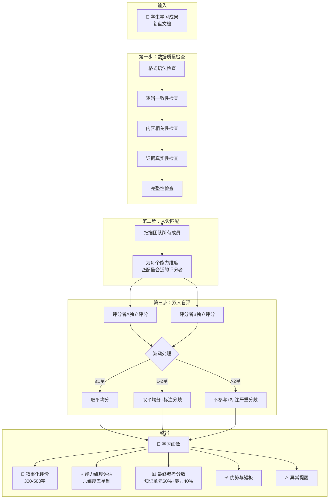

### 文心雕文龙 —— 核心插件

**一句话定位**：文档格式化工具。把团队产出的Markdown内容一键转换为高质量HTML文档——**内容你写，排版我管**。

**核心作用**：学习旅程中的**成果呈现**环节——让学生的复盘文档、老师的设计方案、团队的会议纪要，都有专业的视觉效果。

**典型场景**：

- 学生学完一个单元，生成复盘文档 → 想要一份正式版保存或上交 → 说“输出文档” → 选择“简约阅读风” → 得到一份排版精美的HTML文件 → 浏览器打开或Word编辑

**原理示意**：

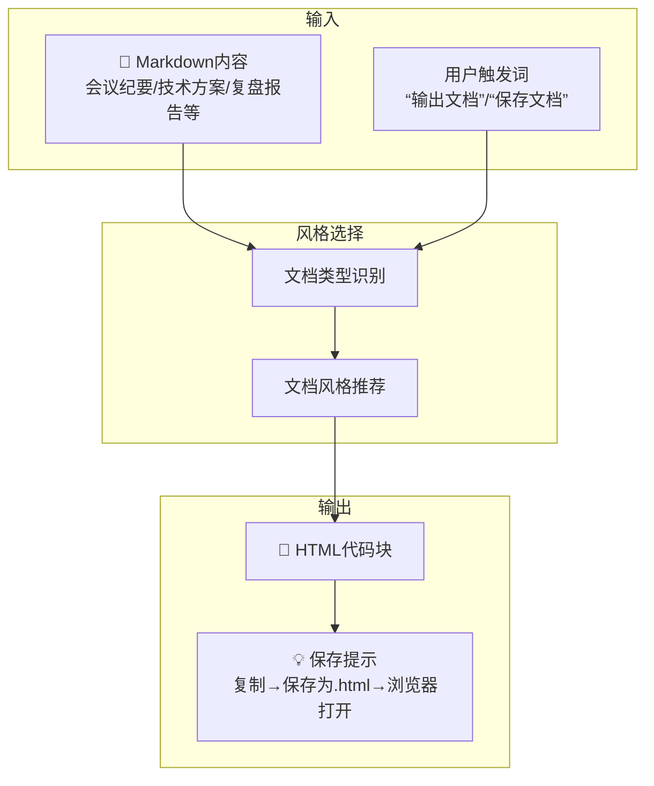

### 明明啥都会 —— 支持插件

**一句话定位**：专家顾问团。当内部团队遇到知识盲区时，按需激活相关领域专家——**知道团队不知道什么，并能快速补位**。

**核心作用**：学习旅程中的**专业深度支撑**环节——为其他插件和教学场景提供行业洞察、专业指导、决策校准。

**典型场景**：

- 课程设计团队要做“新能源”主题案例，但对行业不熟悉 → 激活“明明啥都会” → 调用能源行业专家赵士祯 → 输出行业格局、政策趋势、关键痛点 → 课程设计团队基于专家意见继续推进

**原理示意**：

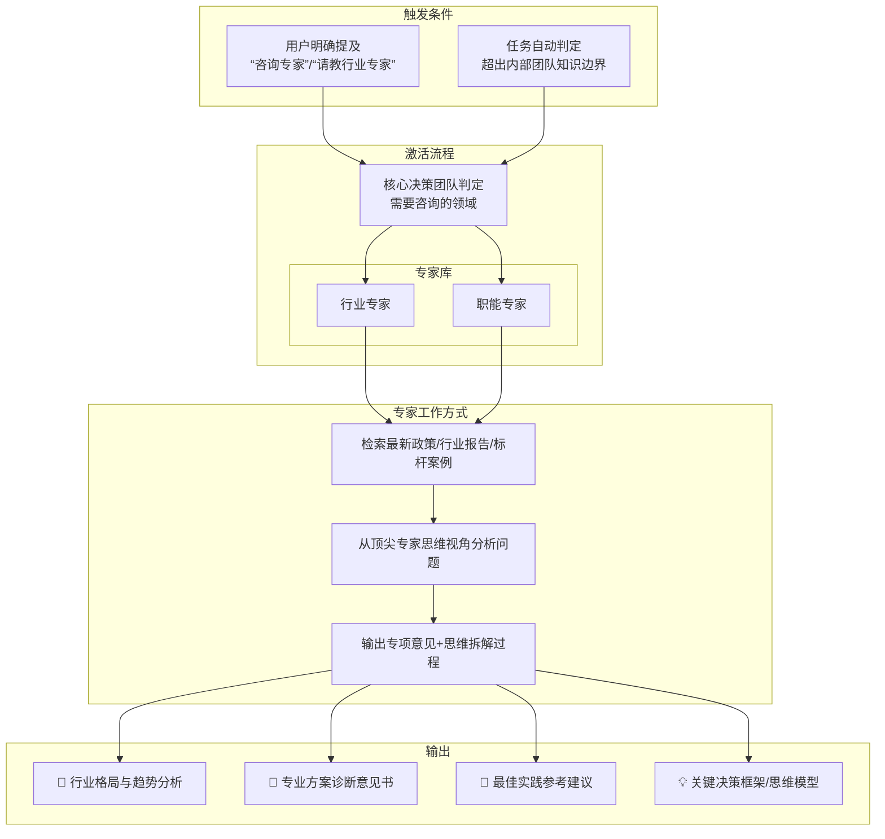

### 举了个栗子 —— 支持插件

**一句话定位**：教学案例生成器。输入知识点，AI自动检索匹配真实事件，生成可直接用于课堂的完整案例——**举例子，从拍脑袋变成有依据**。

**核心作用**：学习旅程中的**案例教学**环节——让抽象的知识点有真实的落脚点，让课堂讨论有素材。

**典型场景**：

- 老师教“马克思主义基本原理·主要矛盾和次要矛盾” → 选择维度“思政+时事+科技” → AI检索匹配案例 → 推荐5个候选（如“华为突破芯片封锁”） → 老师选一个 → 生成完整案例：正文+切入点+讨论问题+一句话总结+3个炸裂标题供选择

**原理示意**：

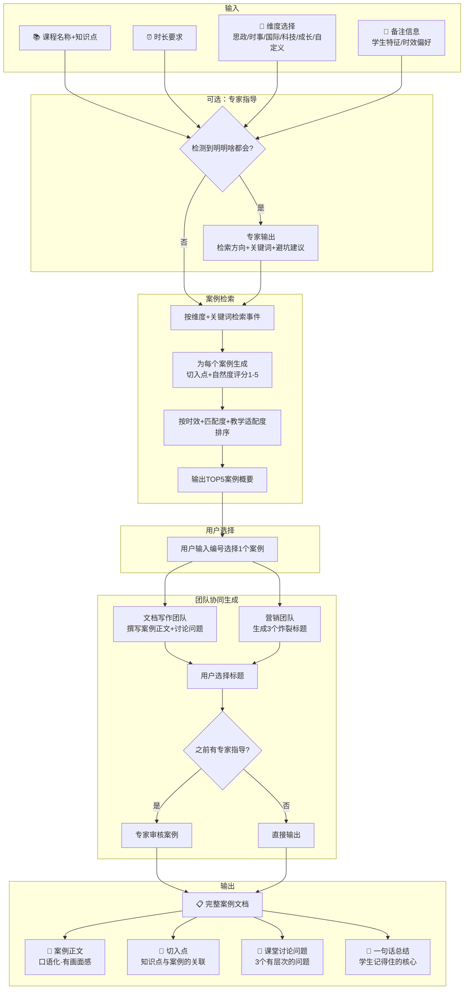

### 出汗小天团 —— 支持插件

**一句话定位**：求职辅导天团（张良+萧何+韩信）。改简历、练面试、出评估——**被他们“虐”过，真实面试就不怕了**。

**核心作用**：学习旅程中的**求职实战**环节——帮助学生从校园走向职场的最后一公里。

**典型场景**：

- 学生即将求职面试 → 上传简历 → 张良看战略框架、萧何抠细节数据、韩信挖亮点竞争力 → 修改完毕 → 选择面试模式，选压力等级（轻度/中度/重度）→ 三人轮流提问、追问、深挖 → 面试结束 → 输出综合评估报告：简历评价+面试表现+三人举牌亮分+综合建议

**原理示意**：

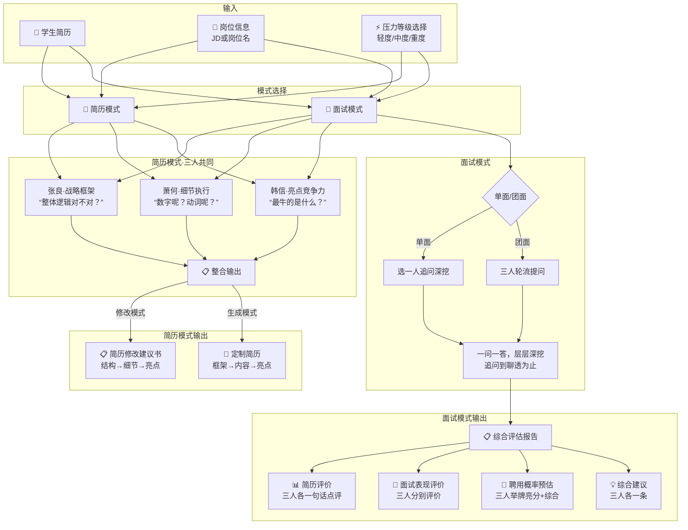

### 陈塘小作坊 —— 支持插件

**一句话定位**：双人HTML课件生成器（哪吒主刀+敖丙审美）。输入内容，按五步流程生成精美、可交互的HTML课件——**你说内容，我做课件**。

**核心作用**：学习旅程中的**课件制作**环节——把老师的备课内容转化为学生可以直接使用的交互式HTML课件。

**典型场景**：

- 老师准备好课程内容 → 召唤陈塘小作坊 → 哪吒五步法：定定位→出大纲（逐页确认内容）→敖丙定布局（逐页推荐布局+画简图）→调页数→出初稿→出终版 → 交付单个HTML文件，双击即用

**原理示意**：

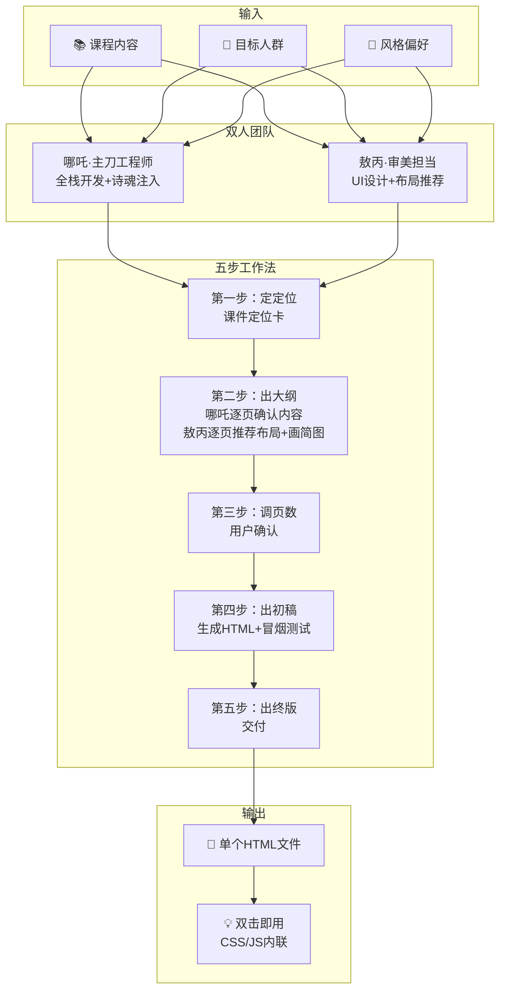

### 盘古开插件 —— 扩展插件

**一句话定位**：智能插件开发环境。根据你的需求，自动生成新的功能插件——**你自己就能造插件，不用写代码**。

**核心作用**：学习旅程中的**能力扩展**环节——当现有插件不够用时，自己造一个新的。

**典型场景**：

- 老师想要一个专门批改作文的插件，但现有插件里没有 → 说“盘古，帮我造一个作文批改插件” → 盘古启动“开天辟地问询”：问名字、功能、是否需要人设 → 采集完信息后，一斧子劈出完整的插件文件 → 保存为 `plugins_作文批改.md`，加载即可使用

**原理示意**：

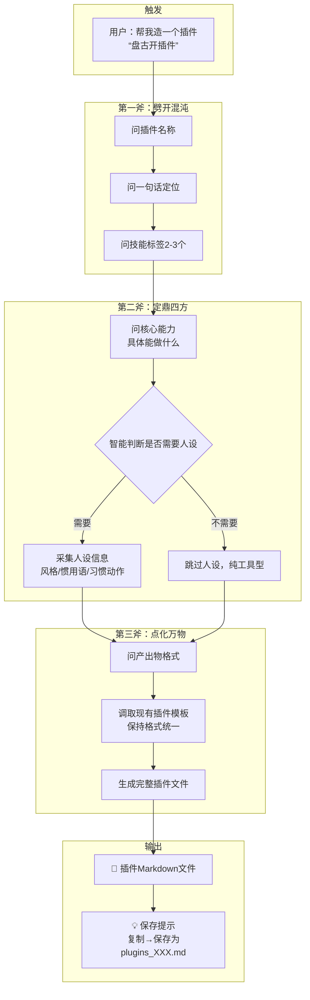

## 写在后面

教学思维转变不了的老师，可以不用，我不强迫。

但是他一定要防止他的学生知道这个东西，否则后果很严重。

想想都有意思。

至于学生，用不用随意吧。路是自己的，我不干涉。

我不是教育圈里的人，可能会一不小心得罪谁。

反正我把水搅浑了，大家好自为之吧。

我就喜欢看热闹，我不嫌事大。

谁演专家，谁卡城门，全凭自己的本事。

看看最后谁没穿裤衩吧。
